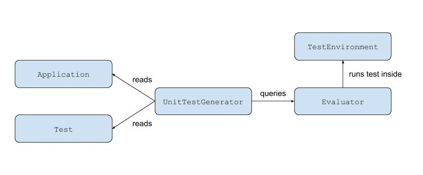

# Design

## Summary

## Classes

### Application

The `Application` class contains information about the containers/pods
such as their name and the arguments used to run them.

#### Giving runtime arguments to applications

For Docker applications, the Application class uses the
[Python Docker SDK](https://docker-py.readthedocs.io/en/stable/containers.html)
for the containers' runtime arguments.

For Kubernetes applications, the Application class uses the
[standard yaml syntax](https://kubernetes.io/docs/concepts/workloads/pods/pod-overview/#pod-templates)
for the pods' runtime arguments.

Examples are available on the [README](README.md) page.

#### Benefits

Encapsulation makes applications easy to maintain and modify for future improvements.

By using runtime arguments that are standard for running containers/pods,
tests can be used to evaluate containers/pods as complex as allowed by their respective interface,
allowing for thorougher tests.

### Test

The `Test` class contains the information about the tests used to evaluate applications.
Information includes the test name, the command to run, and what elements to test.

#### Benefits

Encapsulation makes tests easy to maintain and modify for future improvements.

### UnitTestGenerator

The `UnitTestGenerator` class extends `unittest.TestCase`.
Its role is to generate the unit tests from the application and test specifications.
It also communicates with the `Evaluator` class to run the tests, and get their results.

#### Benefits

`UnitTestGenerator` uses the standard testing framework for Python,
allowing for a familiar interface and a strong base.

### Evaluator

The `Evaluator` class takes an application and test specifications,
executes the test specified and returns the results.

The `Evaluator` executes the test commands in contexts that are defined in the `TestEnvironment` class.

### TestEnvironment

`TestEnvironment` is an abstract class with two children, `DockerTestEnvironment` and `KubernetesTestEnvironment`,
which respectively create an isolated environment for running a container and one for running a pod.

`TestEnvironment` and its subclasses use Python context managers to implement the testing environments.

#### Benefits

`TestEnvironment` allows tests to be separated,
preventing side effects that may happen if tests share the same environment. 
